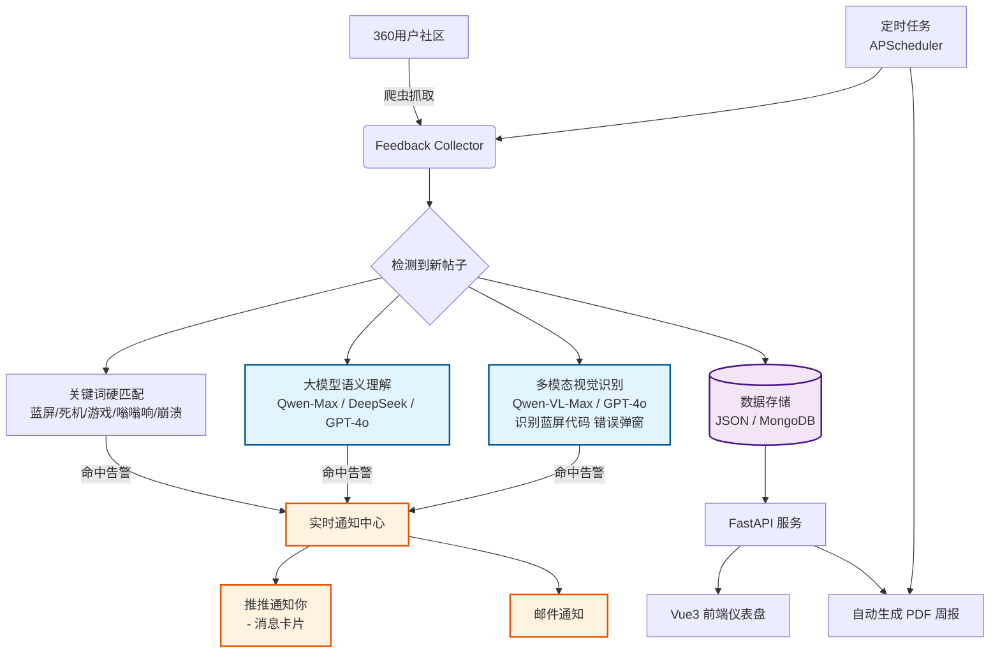

# SentinelEye - 智能用户反馈实时监控系统

一个 AI 测试助手  
7×24h 盯着公司用户社区，一旦出现「蓝屏」「死机」「游戏崩溃」「启动失败」「嗡嗡响」等你负责的问题，立刻推推@你，带原文+截图，让你在问题爆发前就复现它

GitHub: [git@github.com:wddddddddddddddd/SentinelEye](https://github.com/wddddddddddddddd/SentinelEye)

作者：一位再也不想每天手动刷论坛的测试开发

## 未完成功能思路（todo list）：
- 爬虫 -> 定时增量爬虫
- 优化后端main.py
- 优化数据分析代码
- 增加数据分析页面后端逻辑代码
- 生成周报 多专家agent协同（Langchain1.0）
- 邮箱通知
- 域名 反向代理
- 数据存储 json -> ndjson -> mongodb

## 项目背景 & 痛点解决

- 每天手动翻几十页论坛找自己模块的问题，太累且容易漏
- 蓝屏、驱动、游戏兼容类问题往往要等用户骂到热榜才发现
- 领导问「这个月蓝屏反馈有多少？」要临时统计半天

SentinelEye 彻底解放你：
- 自动抓取 + 结构化存储所有反馈（含截图）
- 关键词 + 大模型语义理解 + 多模态视觉识别（识别蓝屏代码、错误弹窗）
- 命中即秒推->推推/邮件
- 前端大屏 + 周/月 Top 问题 + 一键导出 PDF 周报

## 功能清单

| 功能                         | 状态         | 备注                                      |
|------------------------------|--------------|-------------------------------------------|
| 360社区自动抓取              | Done         | 支持分页、去重、防封                      |
| FastAPI + Swagger 文档       | Done         | http://localhost:8000/docs                |
| 关键词硬匹配告警             | Done         | 蓝屏/死机/游戏/嗡嗡响/启动不了等          |
| 推推实时通知（@人+卡片） | Done         | 支持附带原文+截图                         |
| 大模型语义理解               | In Progress  | Qwen-4L / DeepSeek / GPT-4o               |
| 多模态图片识别（蓝屏代码）   | In Progress  | Qwen-VL-Max / GPT-4o                      |
| Vue3 前端仪表盘              | In Progress  | NaiveUI + ECharts                         |
| 周/月问题统计 + PDF 周报     | In Progress  | WeasyPrint 自动生成                       |
| Agent 自动复现（未来）       | Planned      | Playwright 按用户描述操作复现             |


## 系统架构图



## 技术栈（2025 最新实践）

| 层级         | 技术选型                                           | 备注                              |
|--------------|----------------------------------------------------|-----------------------------------|
| 爬虫         | requests + lxml（主力）<br>Playwright（备选）      | 稳定抗封，动态页面直接上 Playwright |
| 后端         | FastAPI + Uvicorn + Pydantic v2                    | 自动 OpenAPI 文档，性能拉满       |
| 数据存储     | 本地 JSON → MongoDB / PostgreSQL                   | 当前 JSON，后面无缝切换数据库     |
| AI 能力      | 文本理解：通义千问 Qwen-4L / DeepSeek-V3<br>多模态视觉：Qwen-VL-Max / GPT-4o | 免费额度够用，蓝屏代码识别极准    |
| 向量检索     | Chroma / Qdrant / Milvus（后续接入）               | 语义去重 + 相似问题聚类           |
| 通知         | 推推 / 邮件                     | 支持 @人 + 富文本卡片 + 附带截图  |
| 前端         | Vue3 + TypeScript + Pinia + NaiveUI + ECharts      | 现代、美观、开箱即用              |
| 周报生成     | WeasyPrint（主力） / Playwright                    | 纯 Python 一键出高清 PDF          |
| 定时任务     | APScheduler                                        | 灵活、分钟级灵活调度                |
| 部署         | Docker + Docker Compose                            | 一键容器化，上云/服务器随便跑     |

## 项目结构

```bash
SentinelEye/
├── backend/
│   ├── main.py                  # FastAPI 启动入口
│   ├── core/
│   │   └── config.py             # 配置 & 密钥管理
│   ├── models/
│   │   feedback.py              # Pydantic 数据模型
│   ├── services/
│   │   ├── crawler.py           # 爬虫主逻辑
│   │   ├── storage.py           # JSON/MongoDB 读写封装
│   │   └── notifier.py          # 推推/邮件实时告警
│   ├── api/
│   │   └── v1/
│   │       └── feedback.py      # 所有接口路由
│   └── data/
│       └── feedbacks.json       # 抓取的数据（git 可忽略）
├── frontend/                    # Vue3 + NaiveUI 大屏（开发中）
├── docs/
│   └── architecture.svg         # 系统架构图（高清矢量）
├── .env                         # 推推 webhook 等密钥
├── .gitignore
├── requirements.txt
├── docker-compose.yml           # 后续会上
└── README.md
```

# 快速开始
git clone https://github.com/yourname/SentinelEye.git
cd SentinelEye

# 安装依赖
pip install -r backend/requirements.txt

# 第一次抓取数据
python backend/services/crawler.py

# 启动服务
uvicorn backend.main:app --reload --port 8000

# 可优化内容

Agent 自动复现：识别到“启动失败”后自动启动虚拟机按用户描述操作复现
问题聚类：用 Embedding 把相似问题聚类，提前发现批量故障
情感分析：识别用户愤怒程度，自动在论坛礼貌回复「已收到，正在处理」
自动回复：机器人去论坛礼貌回复“已收到，正在紧急处理”